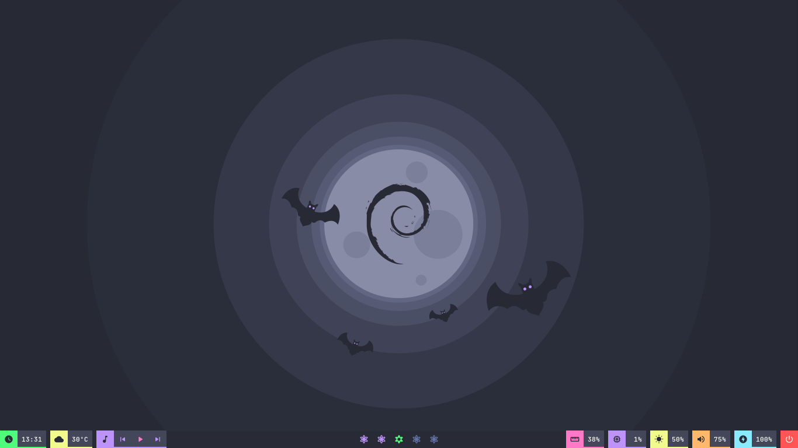
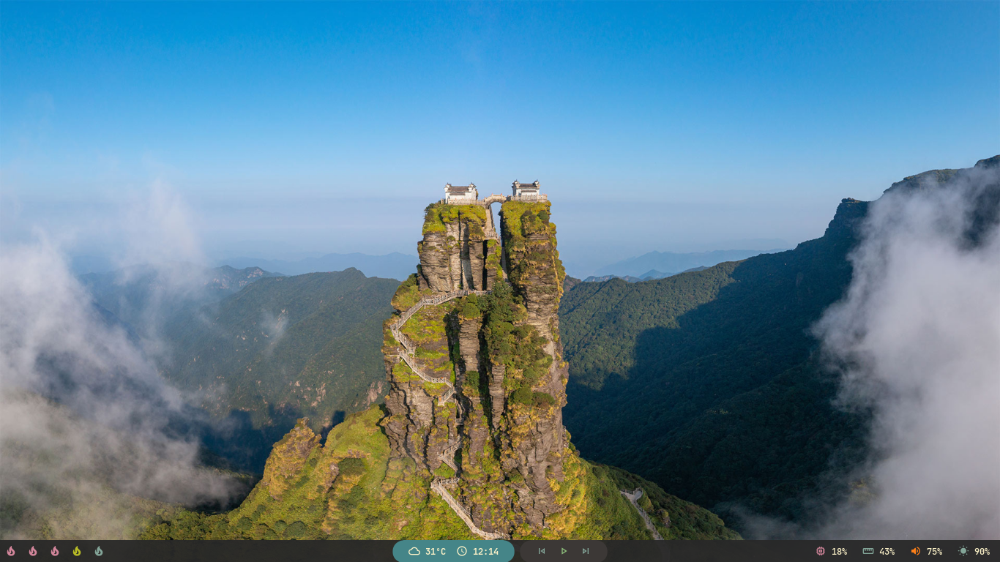
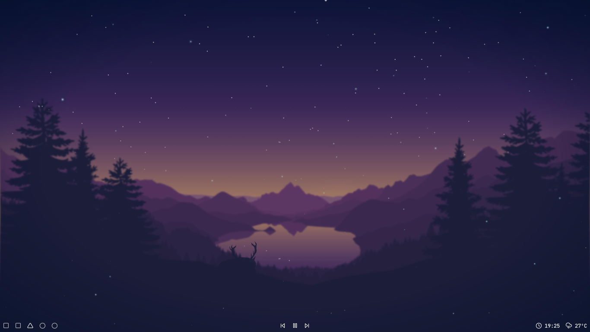
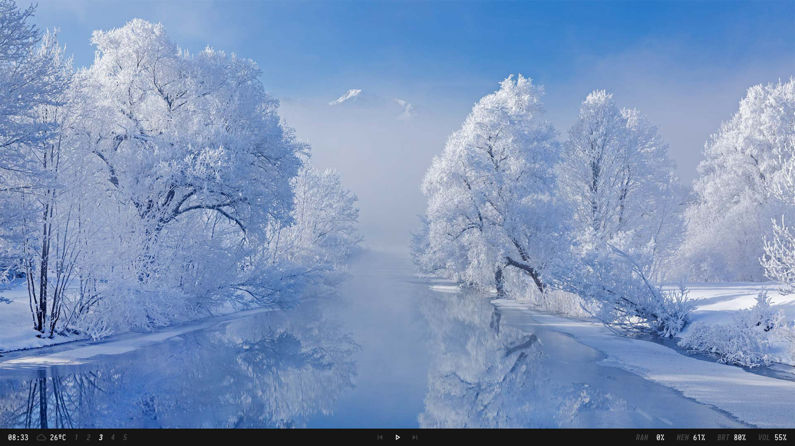
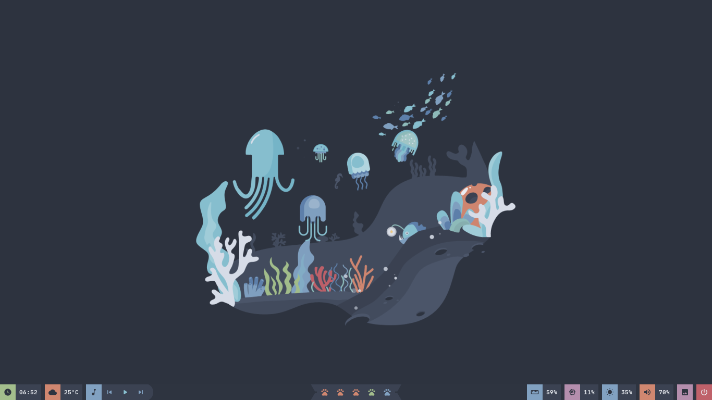
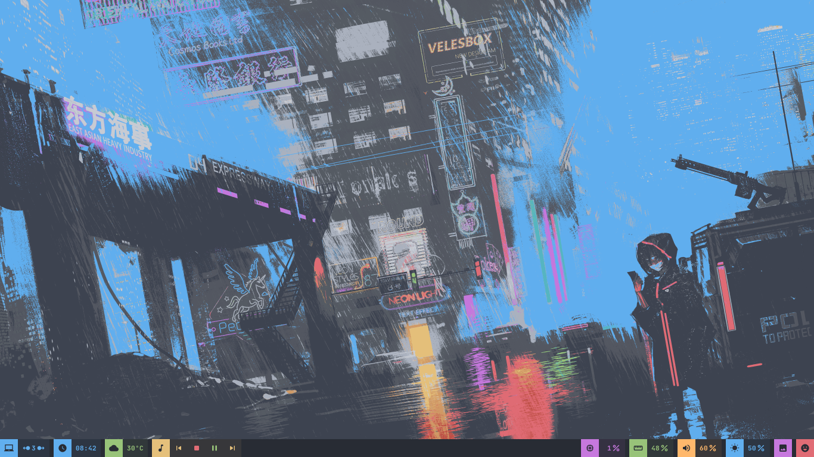

# Polybar Collection

### Murz


```ini
modules-left = date weather round-right
modules-center = round-left bspwm round-right
modules-right = round-left mpd
```

### Chnvok


```ini
modules-left = date weather mpd
modules-center = bspwm
modules-right = memory cpu xbacklight pulseaudio session
```

### Dracula



```ini
modules-left = date margin weather margin mpd
modules-center = bspwm
modules-right = memory margin cpu margin xbacklight margin pulseaudio margin battery margin session
```

### Gruvbox



```ini
modules-left = bspwm
modules-center = round-left-blue weather date round-right-blue margin round-left mpd round-right
modules-right = cpu memory pulseaudio xbacklight
```

### Lofi



```ini
modules-left = bspwm
modules-center = mpd
modules-right = date weather
```

### Material


```ini
modules-left = weather margin date margin mpd tri-upper-right tri-lower-left bspwm tri-upper-right
modules-center = 
modules-right = memory margin cpu margin xbacklight margin pulseaudio
```

### Minimal



```ini
modules-left = date weather bspwm
modules-center = mpd
modules-right = cpu memory xbacklight pulseaudio
```

### Nord



```ini
modules-left = date margin weather margin mpd round-right
modules-center = trap-left bspwm trap-right
modules-right = memory margin cpu margin xbacklight margin pulseaudio margin wallz margin session
```

### One Dark



```ini
modules-left = bspwm margin date margin weather margin mpd
modules-center =
modules-right = cpu margin memory margin pulseaudio margin xbacklight margin wallz margin session
```
